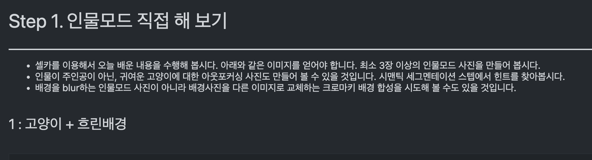
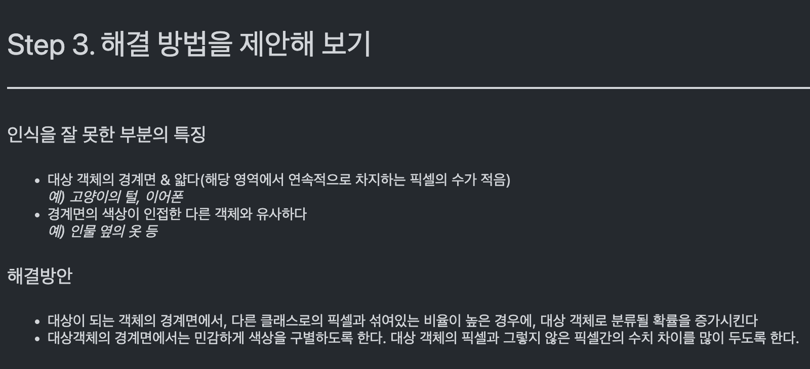
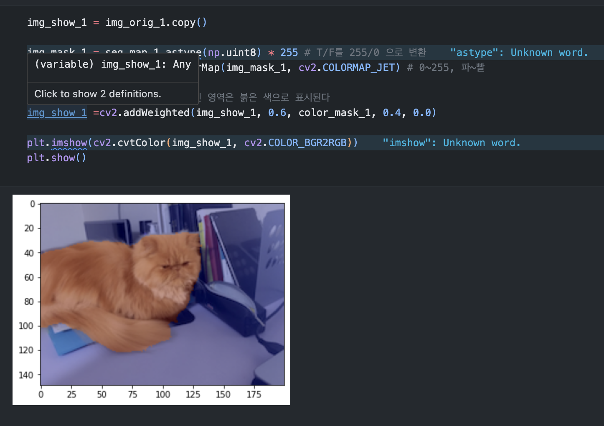

# AIFFEL Campus Online 5th Code Peer Review Templete
- 코더 : 심지안
- 리뷰어 : 조대희


# PRT(PeerReviewTemplate) 
각 항목을 스스로 확인하고 토의하여 작성한 코드에 적용합니다.

- [⭕️] 코드가 정상적으로 동작하고 주어진 문제를 해결했나요?
  
- [⭕️] 주석을 보고 작성자의 코드가 이해되었나요?

  
  
- [⭕️] 코드가 에러를 유발할 가능성이 없나요?
  
- [⭕️] 코드 작성자가 코드를 제대로 이해하고 작성했나요?

  
  
- [⭕️] 코드가 간결한가요?

  

# 예시
1. 코드의 작동 방식을 주석으로 기록합니다.
2. 코드의 작동 방식에 대한 개선 방법을 주석으로 기록합니다.
3. 참고한 링크 및 ChatGPT 프롬프트 명령어가 있다면 주석으로 남겨주세요.


# 참고 링크 및 코드 개선
```python
모듈 임포트 정리: 코드 상단에서 사용하지 않는 모듈이나 라이브러리가 있는지 확인하고 필요 없는 것은 제거하면 코드가 깔끔해집니다.

함수화: 반복적인 작업(예: 이미지 로딩, 세그멘테이션 처리, 결과 표시)은 함수로 만들어 코드의 재사용성을 높일 수 있습니다. 이렇게 하면 여러 이미지에 대한 처리를 더 간결하게 수행할 수 있습니다.

파라미터 튜닝: 사용된 딥러닝 모델의 파라미터나 OpenCV의 함수(예: blur)의 파라미터를 조절하여 성능을 개선할 수 있는지 확인해볼 수 있습니다.

데이터 경로 관리: 코드에서 이미지 경로를 직접 지정하는 방식은 유지 관리 측면에서 좋지 않습니다. 데이터 경로를 별도의 설정 파일이나 환경 변수에서 관리하거나, 사용자 입력을 통해 받는 방식을 고려해볼 수 있습니다.

오류 처리: 이미지 로딩이나 모델 로딩 과정에서 오류가 발생할 가능성을 고려하여 예외 처리를 추가하는 것이 좋습니다.

코드 주석: 코드의 주석을 통해 각 코드 블록이 수행하는 기능을 명확하게 설명하는 것은 코드의 가독성과 유지 보수성을 높입니다.

결과 저장: 현재 코드에서는 일부 결과를 저장하고 있습니다. 모든 중간 결과물과 최종 결과물을 저장하는 기능을 추가하여 분석 및 검토에 활용할 수 있게 하는 것이 좋습니다.

다양한 세그멘테이션 모델 탐색: 현재 코드는 deeplabv3 모델을 사용하고 있습니다. 다른 세그멘테이션 모델(예: U-Net, Mask R-CNN 등)을 사용하여 성능을 비교해보는 것도 고려해볼 만합니다.

코드 최적화: 반복적인 연산이나 불필요한 연산이 있는지 점검하고, 필요한 경우 코드의 최적화를 진행하여 실행 속도를 향상시킬 수 있습니다.

추가 기능 개발: 사용자의 요구에 따라 다양한 기능(예: 특정 객체만 세그멘테이션하여 특정 색상으로 칠하기, 다양한 배경 효과 적용 등)을 추가 개발하는 것을 고려해볼 수 있습니다.
```
